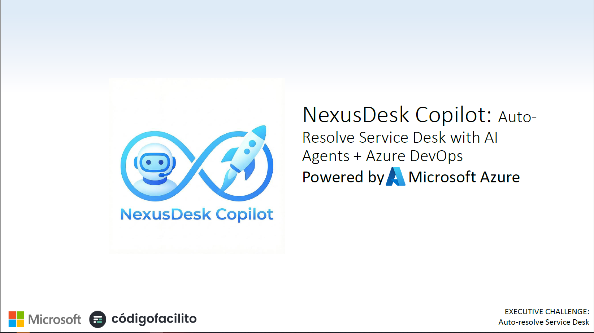
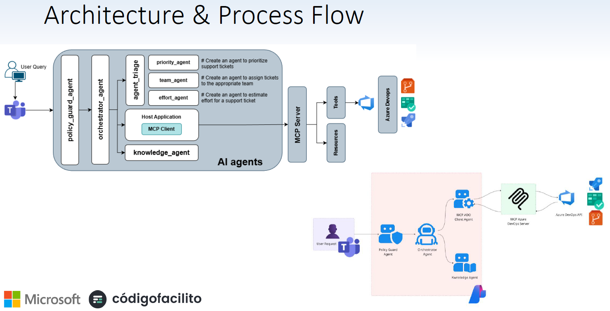
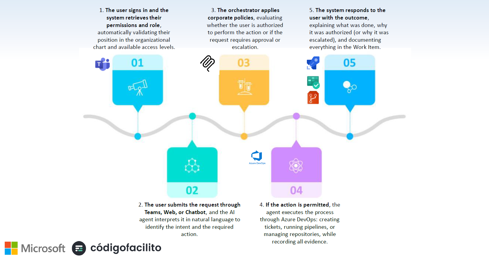
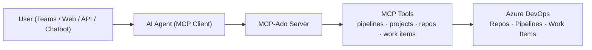
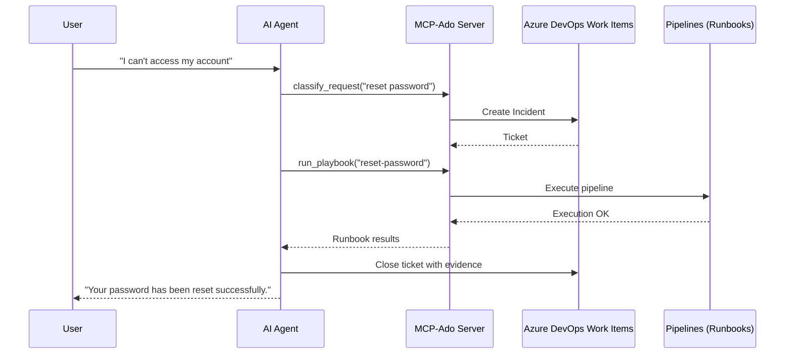
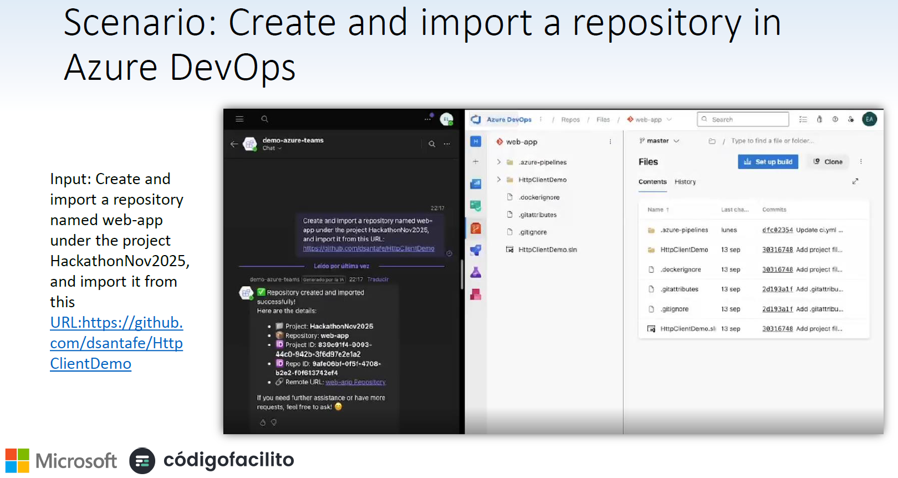

# NexusDesk Copilot — Auto-Resolve Service Desk with AI Agents + Azure DevOps

## 🚀 Executive Summary
NexusDesk Copilot is an AI-powered, multi-agent, auto‑resolution platform that transforms Azure DevOps into an intelligent Service Desk. Built using the Model Context Protocol (MCP), this solution enables agents to understand user requests, classify them, create or resolve tickets, and autonomously trigger automation pipelines.

This project directly addresses **NexusDesk Copilot – Challenge 3: Auto‑resolve Service Desk**, delivering:
- Automatic handling of repetitive requests  
- Safe automation (“runbooks”)  
- Transparent actions with explanations  
- Smart escalation to humans when needed  
- Multi‑channel operation (Web, API, Teams, Chatbots)

---

## 🧩 Project Purpose
Modern enterprises are overloaded with repetitive service tickets: password resets, access requests, license queries, HR FAQs, finance clarifications, etc.  
Our solution implements a **cooperative, multi‑agent service desk** where MCP agents interact through a standardized Azure DevOps backend.

Agents can:
- Create incidents  
- Retrieve documentation  
- Execute remediation steps  
- Run pipelines  
- Close tickets automatically  
- Escalate when complexity exceeds confidence  

---

## ▶️ Components & Flow Diagram



# ▶️ Process flow



## 📁 Project Structure MCP Server ADO

```
/autoservicedesk-mcp-ado-backend
 ├── client/
 │   ├── client.py               → MCP client used by AI agents
 │   ├── Api/                    → Internal API flow for agents
 │   └── Services/               → Business logic used by the client
 ├── server/
 │   ├── tools/
 │   │    ├── pipelines.py       → Executes CI/CD pipelines as runbooks
 │   │    ├── projects.py        → Domain/project catalog
 │   │    ├── repositories.py    → Documentation search
 │   │    ├── work_items.py      → Ticket creation, update, closing
 │   ├── azure_devops_config.py  → Connection settings (ORG, PAT, PROJECT)
 │   ├── server.py               → MCP‑compliant server implementation
 ├── README.md
 ├── .env.example
 ├── requirements.txt
```

---

## 🏗️ High‑Level Architecture



---

## 🤖 Autonomous Ticket Resolution



---

## 🎬 Included Demos (from Postman Collection)

### **Demo 1 — Create a repository & configure branch policies**
Use cases:
- “Create a repo for my new project”
- “Apply enterprise security policies (min reviewers, etc.)”

Operations:
1. Create repository  
2. Import GitHub repository  
3. Verify existing policies  
4. Create branch policies  
5. Modify an existing policy  



---

### **Demo 2 — Grant Contributor access**
Use cases:
- “Give me contributor access to backend-repository”

Operations:
1. Get projects  
2. Get repos  
3. Get security namespaces  
4. Get user identity  
5. Grant Contribute permission  
6. (Optional) Get group identity  
7. Grant permission to group  

---

### **Demo 3 — Create CI pipeline using standard template**
Use cases:
- “I need a CI pipeline for Repo X”

Operations:
1. Generate pipeline template  
2. Get pipeline ID  
3. Execute pipeline  
4. Check pipeline status  

---

### **API Documentation**
- Postman Collection: Import and use the [Postman Collection](https://documenter.getpostman.com/view/3923266/2sB3dLSqs6) for testing all endpoints in Postman.

## 🧠 Features

### ✔️ Multi‑agent cooperation through MCP  
Agents specialize in classification, remediation, documentation lookup, escalation, and user communication.

### ✔️ Safe automation (Runbooks)  
All execution happens through Azure DevOps Pipelines—versioned, secured, auditable.

### ✔️ Full transparency  
The system explains:
- what it did  
- why it did it  
- what evidence was generated  
- what the outcome was  

### ✔️ Real, enterprise‑grade ticket backend  
Azure DevOps Work Items serve as:
- Incidents  
- Service Requests  
- Tasks  
- Change Requests  

### ✔️ Complete demos that work today  
No mockups. Every action is functional and reproducible.

### ✔️ Applicable across all service domains  
- HR  
- Finance  
- Legal  
- IT  
- Customer Service  
- Facilities  

---

## ⚙️ Installation

```bash
git clone <your-repo-url>
cd mcp-ado
python -m venv venv
source venv/bin/activate   # macOS/Linux
venv\Scripts\activate    # Windows
pip install -r requirements.txt
```

---

## 🔐 Configuration

Copy `.env.example` → `.env`:

```
AZURE_DEVOPS_ORG=
AZURE_DEVOPS_PROJECT=
AZURE_DEVOPS_PAT=
```

---

## ▶️ Run MCP Server

```bash
python server/server.py
```

---

## ▶️ Run AI Agent Client

```bash
python client/client.py
```

---

## 📌 Roadmap

- [ ] Add Knowledge Base vector search  
- [ ] Add HR/Finance/Legal domain-specific agents  
- [ ] Support Change Management workflows  
- [ ] Add unified dashboards  
- [ ] Add advanced audit trail with reasoning logs  

---

## 🤝 Contributing
Contributions are welcome! Submit PRs or open issues.

---

## 📄 License
MIT License.
